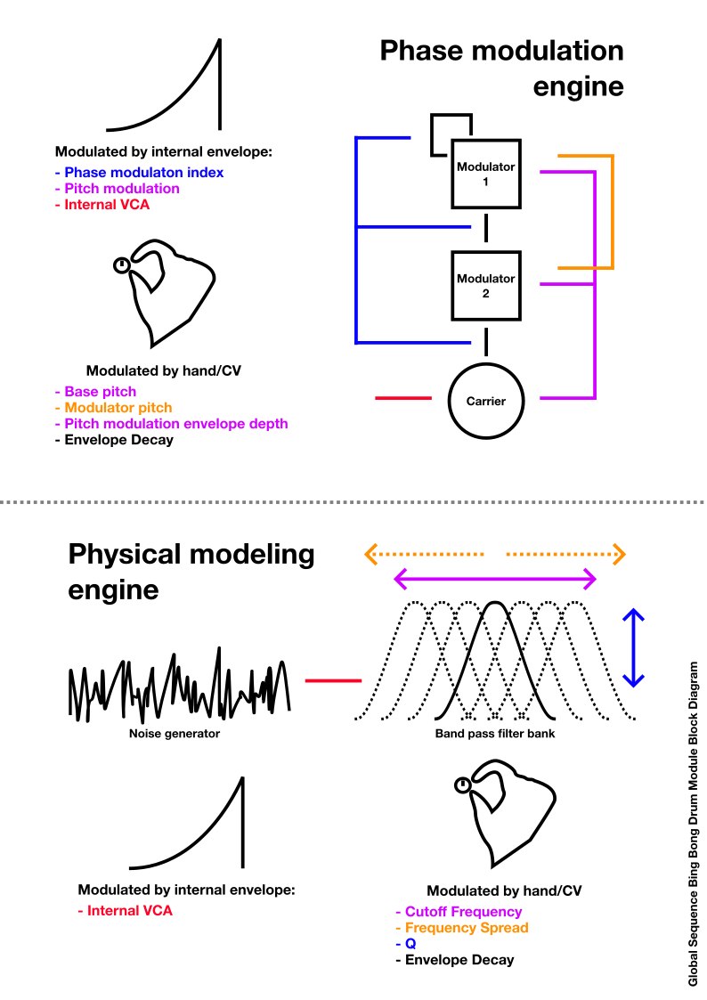

## Intro

Bing Bong is a digital drum synthesizer module for Eurorack synthesizers which generates percussive sounds using two different synthesis methods:

- Phase modulation synthesis
- Physical modeling synthesis

This module is intended to offer a versatile array of sounds ranging anywhere from organic substrates to purely synthesized tones. With a wide frequency range, it can fill many roles in an electronic drum kit. Both atonal and tonal sounds can be produced, ranging anywhere from quick transient bursts to long sustained sounds. 

## Block Diagram

## Features
- Versatile drum voice for modular synthesizers
- Switchable phase modulation and physical modeling sound engines
- Mechanical key switch for tactile manual triggering
- CV inputs for all parameters
- 12 bit, 48khz sound

## Synthesis Engines 
### Phase Modulation
#### Overview
The Phase modulation engine is made up of three sine wave operators, fed into one another in series, The first modulator has operator feedback.

The modulation index of each modulator is controlled by the envelope, with each index being set to maximum when the module is triggered, before fading to an index of 0 when the envelope has faded away, effectively creating a sharp sound which softens over time. 

This engine can be used to achieve deep raunchy kick drums, clean ringing chimes, metallic clangs, chirps, and more.
#### Parameters
##### Carrier 
This may be somewhat misleading as this parameter controls the base pitch of the entire voice. 
##### Modulator
Move the pitch of the two modulator oscillators relative to the pitch of the carrier oscillator. The first modulator is always an octave higher than the second modulator. 

When set very high, the carrier frequency (if also set very high) may push the modulator frequencies into interesting territories, or even to oblivion. There is no anti-aliasing in this module, and that's a feature, not a bug! 
##### Pitch Mod
Set the depth by which the envelope affects the pitch of all oscillators. With this parameter set to zero, there is no pitch modulation. As the pitch mod is turned up, the drum hit will start at increasingly higher frequencies and fall to the lowest frequency at the end of the envelope's decay.
##### Decay
Sets the decay time of the envelope. The envelope modulates these other parameters in the engine:
- Modulation index
- Pitch modulation amount
- Internal VCA
By shortening or lengthening the decay time, you can dramatically alter the trajectory of the sound, because all of the parameters dependent on it.

The decay time can be set from a few milliseconds to several seconds, turning the drum module into a sort of faux-drone that can be used for effects and sound scapes, should you wish to venture into that territory.

### Physical Modeling
#### Overview
The physical modeling engine is comprised of a white noise source which is fed into seven parallel band pass filters with a variable Q. 

This engine can be used to achieve organic drum tones ranging from membrane drums of many shapes and sizes, to percussive surfaces made of other materials like glass, metal, wood, and more. 
#### Parameters
##### Cutoff
This sets the cutoff frequency of the central and peripheral band pass filters. 
##### Spread
Pushes the 6 peripheral band pass filters away from the central filter. 3 peripheral filters are set to a lower frequency than the central filter, while the other 3 are higher. The second and third peripheral filters are twice and thrice as far from the central filter as the first on both the higher and lower end, meaning that the filters are always evenly spaced on the frequency spectrum.

When this parameter is set to zero, all of the filters are at the same frequency. 
##### Q
Sets the emphasis of all band pass filters using feedback. As the Q is turned, up, the center frequency of each filter is amplified to the point of self oscillation, making the atonal noise into distinct tones. 

Unlike the traditional VCF > VCA configuration of most modern synthesizers, the filters are set **after** the noise VCA, meaning that you can trigger a sound with a short decay, and if the Q is high enough, the sound will last longer than the decay.

WARNING: Setting the Q to a very high value will create a very loud self oscillation. Since the Q is independent of the decay, the only way to stop the self oscillation is to turn the Q down.
##### Decay
In the physical modeling engine, the envelope only affects the VCA of the voice, attenuating the sound of the filtered noise generator. As mentioned in the Q section, if the Q is set high enough, self oscillation will continue beyond the envelope decay. 

The decay time can be set from a few milliseconds to several seconds, turning the drum module into a sort of faux-drone that can be used for effects and sound scapes, should you wish to venture into that territory.

## DIY
### DISCLAIMER
This project is provided for informational and educational purposes only. By using the provided instructions, code, and hardware designs, you acknowledge that you are solely responsible for your own safety and the cost of any materials or components used.

If you find an error in the project that needs correction, please alert me and I will make it as soon as possible. 
### Build Guide
TODO: add more in depth instructions
#### Software flashing
The software can be uploaded directly to the MCU from the Arduino IDE. To add the Xiao RA4M1 board manager to your Arduino IDE installation, open Arduino Preferences, and add this to the "Additional boards manager URLs" section: https://files.seeedstudio.com/arduino/package_renesas_1.2.0_index.json
#### PCB Ordering
The hardware/gerbers folder contains three separate zip files, for each pcb of the build. Most PCB fabricators take a drag-and-drop upload method for zip files. Each file will likely have to be a separate purchase. 
#### Mounting the MCU board
The Xiao RA4M1 has castellated holes, allowing for the board to be mounted directly to the PCB, but I recommend instead using the optional 1x7 female pin headers marked as OPTIONAL in the BOM. 

This saves you from the headache of having to desolder the whole thing if anything ever goes wrong with the chip, and comes at the cost of the module being a little taller, but it's ultimately up to you. 